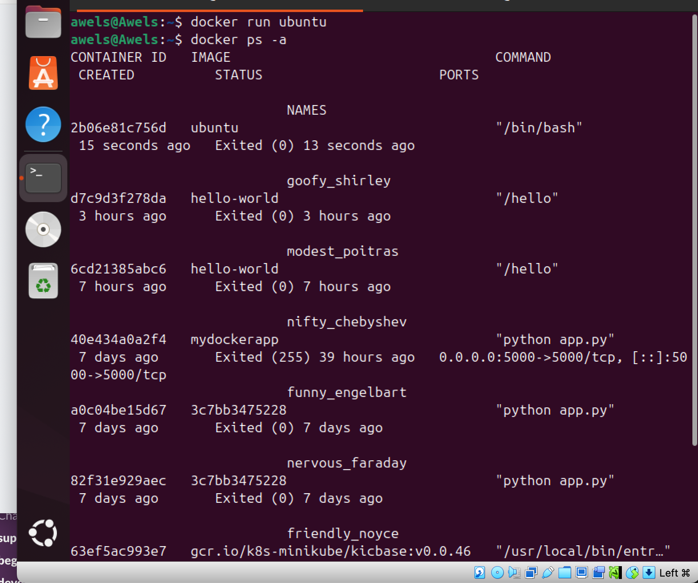
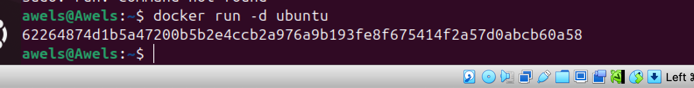
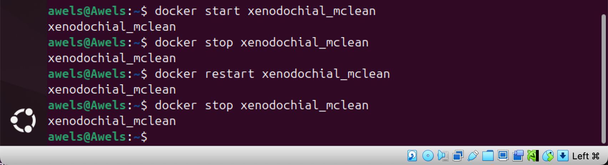
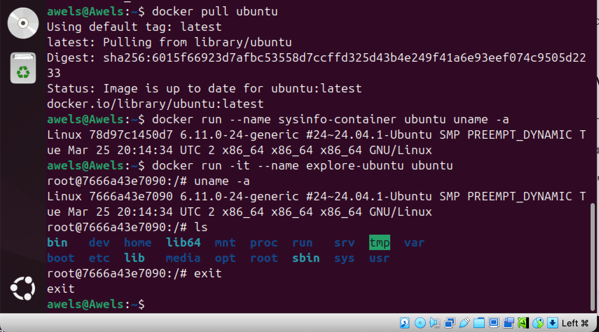
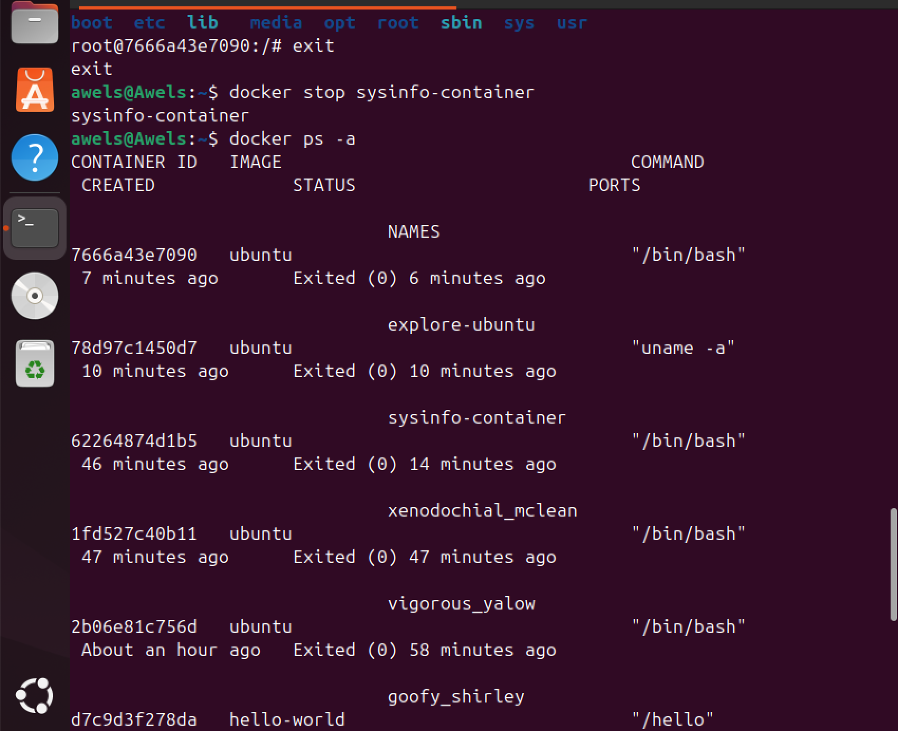
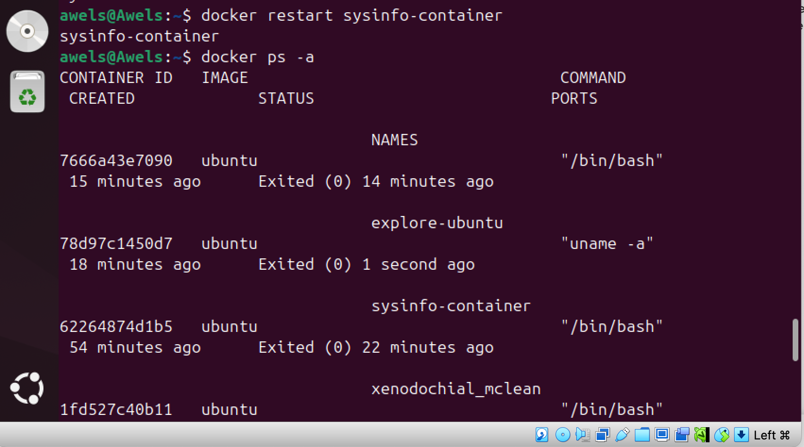
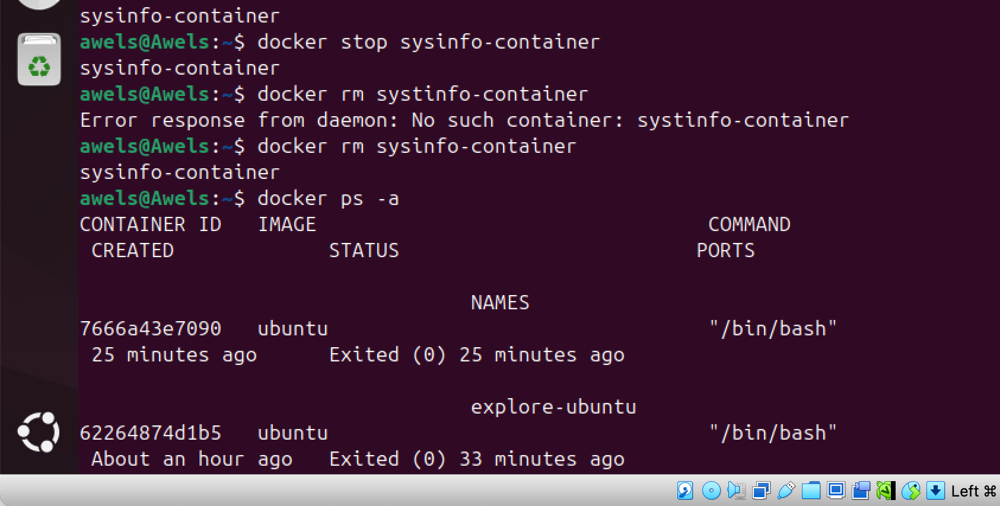
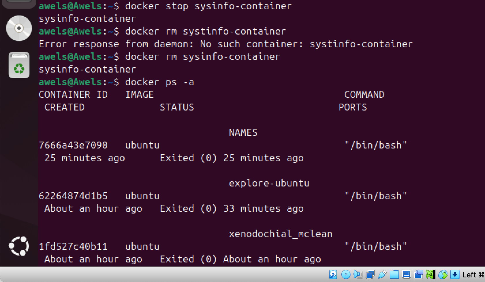
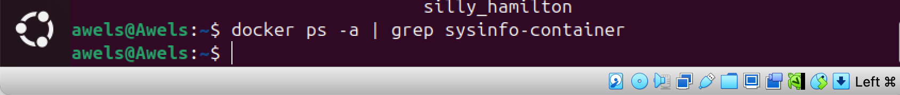

# DockerContainers
Here I will be submiting my Docker containers project

The first command is "docker run ubuntu" after which i proceeded to the second command which is the "docker ps -a" this command showed that the container is created but not running. the images below depicts this 

The next command to start the container by running is "docker start CONTAINER_ID"
the image below depicts this 

the next command is to run the container in the background and this is done by using the command "docker run -d ubuntu"

## START, STOPPING AND RESTARTING CONTAINERS

to start a stopped container, the command is "docker start container_name"
to stop a running container, the command is "docker stop container_name"
to restart a container, the command is "docker restart container_name"

the image below depicts this 

## SIDE TASK
### START A CONTAINER AND RUN A SIMPLE COMMAND 
1. use an official unumtu image to start a container. if you dont have the image you can pull it from docker hub. 
2. run a simple command within the container, such as displaying the container information. 

the image below depicts that these steps have been carried out successfully. 

### STOP THE CONTAINER AND VERIFY ITS STATUS 
1. Stop the running container 
2. verify that the container is stopped 
3. note the status column to confirm the container status. 

the image below depicts this 

### RESTART THE CONTAINER AND OBSERVE CHANGES 
1. Restart the stopped container 
verify the containers status again to ensure it is running
3. observe any changes ordifferences in the containers behavior after the restart. m

the image below depict this

Because the container was originally created to run this and exit: docker run --name sysinfo-container ubuntu uname -a. That container will exit again immediately after restarting because it only runs uname -a, then finishes. That is expected behavior. There’s no persistent process to keep it alive. 
⸻

So what changes are you expected to observe?
	•	Before restart: The container is Exited.
	•	After restart: It briefly changes to Up, then exits again.
	•	The status column reflects this behavior.

### REMOVE THE CONTAINER
1. stop the running contak (if it is stil running)
2. remnove the container 
3. verify that the container is removed 
confirm that the container is no longer listed 

the images below depicts this 

## CONCLUSION

This project has equipped me with a strong foundational grasp of Docker and containerization concepts. Through hands-on practice, I have learned how to confidently create containers from official images, run them using different execution modes, and manipulate them interactively using Bash. I’ve become adept at managing containers through their entire lifecycle — from launching and executing them with custom environment variables to stopping, restarting, and eventually removing them when no longer needed.

What’s more, the inclusion of detached mode operations gave me a practical understanding of how containers behave in the background, which is critical for deploying long-running services or background processes. By going beyond the tutorial to experiment with additional Docker commands — such as inspecting container logs, using docker exec, and analyzing container states — I gained valuable insights that bridged the gap between beginner-level usage and practical, real-world application.

This self-directed exploration not only strengthened my mastery of the core Docker toolset but also built my confidence to apply containerization in real development and deployment workflows. I now feel better prepared to integrate Docker into larger DevOps pipelines, collaborate on container-based projects, and even begin exploring advanced topics like Docker Compose and Kubernetes in the near future.

